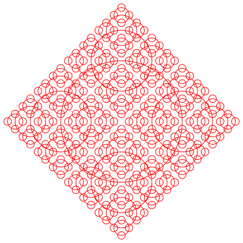
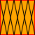

# racket-simple-svg

A SVG(Scalable Vector Graphics) generate tool for Racket
==================

thanks to Joni's tutorial: [SVG Pocket Guide](http://svgpocketguide.com/)

# Install
    raco pkg install simple-svg

# ShowCase-1: Recursive circle

```racket
(let ([canvas_size 400])
  (with-output-to-file
      "recursive.svg" #:exists 'replace
      (lambda ()
        (printf "~a\n"
                (svg-out
                 canvas_size canvas_size
                 (lambda ()
                   (let ([_sstyle (sstyle-new)])
                     (set-SSTYLE-stroke! _sstyle "red")
                     (set-SSTYLE-stroke-width! _sstyle 1)

                     (letrec ([recur-circle 
                               (lambda (x y radius)
                                 (let ([circle_id (svg-def-shape (new-circle radius))])
                                   (svg-place-widget circle_id #:style _sstyle #:at (cons x y)))

                                 (when (> radius 8)
                                   (recur-circle (+ x radius) y (/ radius 2))
                                   (recur-circle (- x radius) y (/ radius 2))
                                   (recur-circle x (+ y radius) (/ radius 2))
                                   (recur-circle x (- y radius) (/ radius 2))))])
                       (recur-circle 200 200 100)))))))))
```


# ShowCase-2: Recursive fern (Thanks to the author: Matteo d'Addio matteo.daddio@live.it)


# ShowCase-3: Five circles

```racket
(with-output-to-file
    "five_circles.svg" #:exists 'replace
    (lambda ()
      (printf
       "~a\n"
       (svg-out
        500 300
        (lambda ()
          (let ([circle1_sstyle (sstyle-new)]
                [circle2_sstyle (sstyle-new)]
                [circle3_sstyle (sstyle-new)]
                [circle4_sstyle (sstyle-new)]
                [circle5_sstyle (sstyle-new)]
                [circle_id (svg-def-shape (new-circle 60))]
                [filter_id (svg-def-shape (new-blur-dropdown))]
                )

            (set-SSTYLE-stroke! circle1_sstyle "rgb(11, 112, 191)")
            (set-SSTYLE-stroke-width! circle1_sstyle 12)

            (set-SSTYLE-stroke! circle2_sstyle "rgb(240, 183, 0)")
            (set-SSTYLE-stroke-width! circle2_sstyle 12)

            (set-SSTYLE-stroke! circle3_sstyle "rgb(0, 0, 0)")
            (set-SSTYLE-stroke-width! circle3_sstyle 12)

            (set-SSTYLE-stroke! circle4_sstyle "rgb(13, 146, 38)")
            (set-SSTYLE-stroke-width! circle4_sstyle 12)

            (set-SSTYLE-stroke! circle5_sstyle "rgb(214, 0, 23)")
            (set-SSTYLE-stroke-width! circle5_sstyle 12)

            (svg-place-widget circle_id #:style circle1_sstyle #:at '(120 . 120) #:filter_id filter_id)
            (svg-place-widget circle_id #:style circle2_sstyle #:at '(180 . 180) #:filter_id filter_id)
            (svg-place-widget circle_id #:style circle3_sstyle #:at '(260 . 120) #:filter_id filter_id)
            (svg-place-widget circle_id #:style circle4_sstyle #:at '(320 . 180) #:filter_id filter_id)
            (svg-place-widget circle_id #:style circle5_sstyle #:at '(400 . 120) #:filter_id filter_id)
            ))))))
```


# ShowCase-4: Racket Logo (Plain svg and Blur Effect svg)


# Steps to use

1. use svg-out to define a canvas and a lambda to define all the things, at the end, output complete svg string.

2. all svg defines shoud be included in the lambda.

3. use svg-def-shape and new-* create a shape with basic properties.

4. use sstyle-new and set-SSTYLE-* define a new style.

5. if needed, use svg-def-group to combine a more complicated pattern.

6. use svg-place-widget to show a shape or a group at specific postion and style.

# Basic Example

```racket
(svg-out
 100 100
 (lambda ()
   (let ([rec_id (svg-def-shape (new-rect 100 100))]
         [_sstyle (sstyle-new)])

     (set-SSTYLE-fill! _sstyle "#BBC42A")
     (svg-place-widget rec_id #:style _sstyle #:at '(50 . 50)))))
```


# Group Example

```racket
(svg-out
 100 100
 (lambda ()
   (let (
         [rect_id (svg-def-shape (new-rect 50 50))]
         [line1_id (svg-def-shape (new-line '(10 . 0) '(0 . 50)))]
         [line2_id (svg-def-shape (new-line '(0 . 0) '(10 . 50)))]
         [rect_sstyle (sstyle-new)]
         [group_sstyle (sstyle-new)]
         [cross_line_id #f]
         [pattern_id #f]
         )

     (set-SSTYLE-stroke-width! group_sstyle 1)
     (set-SSTYLE-stroke! group_sstyle "black")
     (set! cross_line_id
           (svg-def-group
            (lambda ()
              (svg-place-widget line1_id #:style group_sstyle)
              (svg-place-widget line2_id #:style group_sstyle)
              )))

     (set-SSTYLE-stroke-width! rect_sstyle 2)
     (set-SSTYLE-stroke! rect_sstyle "red")
     (set-SSTYLE-fill! rect_sstyle "orange")
     (set! pattern_id
           (svg-def-group
            (lambda ()
              (svg-place-widget rect_id #:style rect_sstyle)
              (svg-place-widget cross_line_id #:at '(0 . 0))
              (svg-place-widget cross_line_id #:at '(10 . 0))
              (svg-place-widget cross_line_id #:at '(20 . 0))
              (svg-place-widget cross_line_id #:at '(30 . 0))
              (svg-place-widget cross_line_id #:at '(40 . 0)))))

     (svg-place-widget pattern_id #:at '(0 . 0))
     (svg-place-widget pattern_id #:at '(50 . 0))
     (svg-place-widget pattern_id #:at '(0 . 50))
     (svg-place-widget pattern_id #:at '(50 . 50)))))
```



# Detail usage please see the racket docs.
