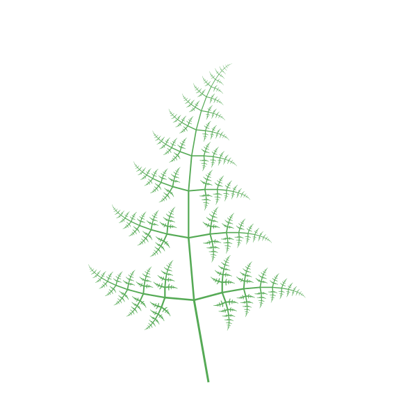
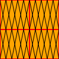

# racket-simple-svg

A SVG(Scalable Vector Graphics) generate tool for Racket
==================

thanks to Joni's tutorial: [SVG Pocket Guide](http://svgpocketguide.com/)

# Install
    raco pkg install simple-svg

# ShowCase-1: Recursive circle

https://github.com/simmone/racket-simple-svg/blob/master/simple-svg/showcase/example/recursive.rkt


# ShowCase-2: Recursive fern (Thanks to the author: Matteo d'Addio matteo.daddio@live.it)

https://github.com/simmone/racket-simple-svg/blob/master/simple-svg/showcase/example/recursive.rkt



# Basic Step

1. use svg-out to define a canvas and a lambda to define all the things, at the end, output complete svg string.

2. all svg defines shoud be included in the lambda.

3. use svg-def-shape and new-* create a shape with basic properties.

4. use sstyle-new and set-SSTYLE-* define a new style.

5. if needed, use svg-def-group to combine a more complicated pattern.

6. use svg-place-widget to show a shape or a group at specific postion and style.

# Basic Example

```racket
(svg-out
 100 100
 (lambda ()
   (let ([rec_id (svg-def-shape (new-rect 100 100))]
         [_sstyle (sstyle-new)])

     (set-SSTYLE-fill! _sstyle "#BBC42A")
     (svg-place-widget rec_id #:style _sstyle #:at '(50 . 50)))))
```


# Group Example

```racket
(svg-out
 100 100
 (lambda ()
   (let (
         [rect_id (svg-def-shape (new-rect 50 50))]
         [line1_id (svg-def-shape (new-line '(10 . 0) '(0 . 50)))]
         [line2_id (svg-def-shape (new-line '(0 . 0) '(10 . 50)))]
         [rect_sstyle (sstyle-new)]
         [group_sstyle (sstyle-new)]
         [cross_line_id #f]
         [pattern_id #f]
         )

     (set-SSTYLE-stroke-width! group_sstyle 1)
     (set-SSTYLE-stroke! group_sstyle "black")
     (set! cross_line_id
           (svg-def-group
            (lambda ()
              (svg-place-widget line1_id #:style group_sstyle)
              (svg-place-widget line2_id #:style group_sstyle)
              )))

     (set-SSTYLE-stroke-width! rect_sstyle 2)
     (set-SSTYLE-stroke! rect_sstyle "red")
     (set-SSTYLE-fill! rect_sstyle "orange")
     (set! pattern_id
           (svg-def-group
            (lambda ()
              (svg-place-widget rect_id #:style rect_sstyle)
              (svg-place-widget cross_line_id #:at '(0 . 0))
              (svg-place-widget cross_line_id #:at '(10 . 0))
              (svg-place-widget cross_line_id #:at '(20 . 0))
              (svg-place-widget cross_line_id #:at '(30 . 0))
              (svg-place-widget cross_line_id #:at '(40 . 0)))))

     (svg-place-widget pattern_id #:at '(0 . 0))
     (svg-place-widget pattern_id #:at '(50 . 0))
     (svg-place-widget pattern_id #:at '(0 . 50))
     (svg-place-widget pattern_id #:at '(50 . 50)))))
```



# Detail usage please see the racket docs.