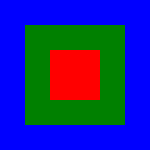
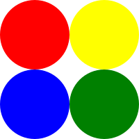
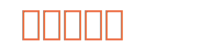
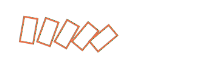

# racket-simple-svg

A SVG(Scalable Vector Graphics) generate tool for Racket
==================

# Install
    raco pkg install simple-svg

# Basic Usage
```racket
(svg-out
  100 100
  (lambda ()
    (let ([rec (svg-rect-def 100 100)]
          [_sstyle (sstyle-new)])

      (set-sstyle-fill! _sstyle "#BBC42A")
      (svg-use-shape rec _sstyle)
      (svg-show-default))))
```


## svg-out
```racket
(svg-out
  width natural?
  height natural?
  procedure procedure?
  [#:viewBox? viewBox? (or/c #f (list/c natural? natural? natural? natural?)) #f]
```
  specify width and height manully.

  viewBox?: '(x y width height), if needed.

## basic usage

  1. use svg-out to generate svg content
  2. all svg drawings should occur in the svg-out's procedure.
  3. you should specify the svg whole size manully.
  4. use svg-...-def define shape first, it includes shape's baisc properties: width, height, radius etc.
  5. use sstyle struct to give shape style properties: stroke, fill etc.
  6. svg-use-shape to claim how to show a shape in a group by style(sstyle) and position(#:at?). if not specify which group, all svg-use included in the default group.
  7. svg-show-default shows default group at '(0 . 0).

  define shape first, then define group, reuse shape and style in group(s), show group(s) with style in canvas.

```racket
(let (
      [blue_rec (svg-rect-def 150 150)]
      [_blue_sstyle (sstyle-new)]
      [green_rec (svg-rect-def 100 100)]
      [_green_sstyle (sstyle-new)]
      [red_rec (svg-rect-def 50 50)]
      [_red_sstyle (sstyle-new)]
     )

      (set-sstyle-fill! _blue_sstyle "blue")
      (svg-use-shape blue_rec _blue_sstyle)

      (set-sstyle-fill! _green_sstyle "green")
      (svg-use-shape green_rec _green_sstyle #:at? '(25 . 25))

      (set-sstyle-fill! _red_sstyle "red")
      (svg-use-shape red_rec _red_sstyle #:at? '(50 . 50))

      (svg-show-default))
```


# Svg Style

each shape and group can have multiple styles: stroke, fill etc.

sstyle is a struct, it represent a shape or group's style.

svg-use-shape and svg-show-group should use the sstyle.

```racket
(define sstyle/c
  (struct/dc
   sstyle
     [fill string?]
     [fill-rule (or/c #f 'nonzero 'evenodd 'inerit)]
     [fill-opacity (or/c #f (between/c 0 1))]
     [stroke (or/c #f string?)]
     [stroke-width (or/c #f natural?)]
     [stroke-linecap (or/c #f 'butt 'round 'square 'inherit)]
     [stroke-linejoin (or/c #f 'miter 'round 'bevel)]
     [stroke-miterlimit (or/c #f (>=/c 1))]
     [stroke-dasharray (or/c #f string?)]
     [stroke-dashoffset (or/c #f natural?)]
     [translate (or/c #f (cons/c natural? natural?))]
     [rotate (or/c #f integer?)]
     [scale (or/c #f natural? (cons/c natural? natural?))]
     [skewX (or/c #f natural?)]
     [skewY (or/c #f natural?)]
    ))
```
(sstyle-new) generate a default sstyle.

(ssylte-clone sstyle) clone a exist sstyle.

# Shapes

## Rectangle

```racket
(svg-rect-def
  width natural?
  height natural?
  #:radius? [radius? #f]
```
  define a rectangle.

  use radius to set corner radius: '(radiusX . radiusY).

### rect
```racket
(let ([rec (svg-rect-def 100 100)])
  (svg-use rec #:fill? "#BBC42A")
  (svg-show-default))
```


### with start_point(no padding)
```racket
(let ([rec (svg-rect-def 100 100)]
      [_sstyle (sstyle-new)])
  (set-sstyle-fill! _sstyle "#BBC42A")
  (svg-use-shape rec _sstyle)
  (svg-show-default))
```


### corner radius
```racket
(let ([rec (svg-rect-def 100 100)]
      [_sstyle (sstyle-new)])

  (set-sstyle-fill! _sstyle "#BBC42A")
  (svg-use-shape rec _sstyle #:at? '(50 . 50))
  (svg-show-default))
```


### multiple rect
```racket
(let (
      [blue_rec (svg-rect-def 150 150)]
      [_blue_sstyle (sstyle-new)]
      [green_rec (svg-rect-def 100 100)]
      [_green_sstyle (sstyle-new)]
      [red_rec (svg-rect-def 50 50)]
      [_red_sstyle (sstyle-new)])

  (set-sstyle-fill! _blue_sstyle "blue")
  (svg-use-shape blue_rec _blue_sstyle)

  (set-sstyle-fill! _green_sstyle "green")
  (svg-use-shape green_rec _green_sstyle #:at? '(25 . 25))

  (set-sstyle-fill! _red_sstyle "red")
  (svg-use-shape red_rec _red_sstyle #:at? '(50 . 50))

  (svg-show-default))
```


## Circle

```racket
(svg-circle-def
   radius natural?)
```
  define a circle by radius length.
  
### circle
```racket
(let ([circle (svg-circle-def 50)]
      [_sstyle (sstyle-new)])

  (set-sstyle-fill! _sstyle "#BBC42A")
  (svg-use-shape circle _sstyle #:at? '(50 . 50))
  (svg-show-default))
```


### multiple circle
```racket
(let ([circle (svg-circle-def 50)]
      [red_sstyle (sstyle-new)]
      [yellow_sstyle (sstyle-new)]
      [blue_sstyle (sstyle-new)]
      [green_sstyle (sstyle-new)])

  (set-sstyle-fill! red_sstyle "red")
  (svg-use-shape circle red_sstyle #:at? '(50 . 50))

  (set-sstyle-fill! yellow_sstyle "yellow")
  (svg-use-shape circle yellow_sstyle #:at? '(150 . 50))

  (set-sstyle-fill! blue_sstyle "blue")
  (svg-use-shape circle blue_sstyle #:at? '(50 . 150))

  (set-sstyle-fill! green_sstyle "green")
  (svg-use-shape circle green_sstyle #:at? '(150 . 150))

  (svg-show-default))
```


## Ellipse

```racket
(svg-ellipse-def
  radius (cons/c natural? natural?))
```
  define a ellipse by radius length: '(width . height).
  
### ellipse
```racket
(let ([ellipse (svg-ellipse-def '(100 . 50))]
      [_sstyle (sstyle-new)])

  (set-sstyle-fill! _sstyle "#7AA20D")
  (svg-use-shape ellipse _sstyle #:at? '(100 . 50))
  (svg-show-default))
```


## Line

```racket
(svg-line-def
    start_point (cons/c natural? natural?)
    end_point (cons/c natural? natural?))
```
  define a line by start, end point.
  
### line
```racket
(let ([line (svg-line-def '(0 . 0) '(100 . 100))]
      [_sstyle (sstyle-new)])

  (set-sstyle-stroke-width! _sstyle 10)
  (set-sstyle-stroke! _sstyle "#765373")
  (svg-use-shape line _sstyle #:at? '(5 . 5))
  (svg-show-default))
```


## Polyline

```racket
(define (polyline points))
```
  define a polyline by points list.
  
### polyline
```racket
(let ([polyline
         (svg-polyline-def
           '((0 . 0) (40 . 0) (40 . 40) (80 . 40) (80 . 80) (120 . 80) (120 . 120)))]
      [_sstyle (sstyle-new)])

  (set-sstyle-stroke-width! _sstyle 5)
  (set-sstyle-stroke! _sstyle "#BBC42A")
  (set-sstyle-fill! _sstyle "blue")

  (svg-use-shape polyline _sstyle #:at? '(5 . 5))
  (svg-show-default))
```


## Polygon

```racket
(svg-polygon-def
    points (listof (cons/c natural? natural?)))
```
  define a polygon by points list.
  
### polygon
```racket
(let ([polygon
         (svg-polygon-def
           '((0 . 25) (25 . 0) (75 . 0) (100 . 25) (100 . 75) (75 . 100) (25 . 100) (0 . 75)))]
      [_sstyle (sstyle-new)])

  (set-sstyle-stroke-width! _sstyle 5)
  (set-sstyle-stroke! _sstyle "#765373")
  (set-sstyle-fill! _sstyle "#ED6E46")

  (svg-use-shape polygon _sstyle #:at? '(5 . 5))
  (svg-show-default))
```


## Path

define a path programmtially.

```racket
(define (svg-path-def
          path_proc procedure?))
```
  all path actions should be include in this procedure: moveto, curve etc.

### Raw Path

```racket
(define (svg-path-raw
          raw_data string?))
```
  define a bunch path by raw data.

### rawpath
```racket
(let ([path
       (svg-path-def
         (lambda ()
         (svg-path-raw
         "M248.761,92c0,9.801-7.93,17.731-17.71,17.731c-0.319,0-0.617,0-0.935-0.021
         c-10.035,37.291-51.174,65.206-100.414,65.206 c-49.261,0-90.443-27.979-100.435-65.334
         c-0.765,0.106-1.531,0.149-2.317,0.149c-9.78,0-17.71-7.93-17.71-17.731
         c0-9.78,7.93-17.71,17.71-17.71c0.787,0,1.552,0.042,2.317,0.149
         C39.238,37.084,80.419,9.083,129.702,9.083c49.24,0,90.379,27.937,100.414,65.228h0.021
         c0.298-0.021,0.617-0.021,0.914-0.021C240.831,74.29,248.761,82.22,248.761,92z")))]
      [sstyle_path (sstyle-new)])

    (set-sstyle-fill! sstyle_path "#7AA20D")
    (set-sstyle-stroke-width! sstyle_path 9)
    (set-sstyle-stroke! sstyle_path "#7AA20D")
    (set-sstyle-stroke-linejoin! sstyle_path 'round)
                
    (svg-use-shape path sstyle_path)

    (svg-show-default))
```


### svg-path-moveto/moveto*
```racket
(define (svg-path-moveto point)
(define (svg-path-moveto* point)
```
  moveto* use absolute position.

  moveto use relative position.

### svg-close-path
```racket
(define (svg-path-close))
```
close a path.

### svg-path-lineto/lineto*/hlineto/vlineto

```racket
(define (svg-path-lineto point)
```
  lineto* is the absolute version.
  horizontal line: hlineto.
  vertical line: vlineto.

```racket
(let ([path
  (svg-path-def
    (lambda ()
      (svg-path-moveto* '(5 . 5))
      (svg-path-hlineto 100)
      (svg-path-vlineto 100)
      (svg-path-lineto '(-50 . 50))
      (svg-path-lineto '(-50 . -50))
      (svg-path-close)))]
     [sstyle_path (sstyle-new)])

  (set-sstyle-stroke-width! sstyle_path 5)
  (set-sstyle-stroke! sstyle_path "#7AA20D")
  (set-sstyle-stroke-linejoin! sstyle_path 'round)
  (svg-use-shape path sstyle_path)

  (svg-show-default))
```


### Quadratic Bezier Curve

```racket
(define (svg-path-qcurve point1 point2)
(define (svg-path-qcurve* point1 point2)
```
  use two control points to draw a Quadratic Bezier Curve.

  qcurve* use absolute position.

  qcurve use relative position, relative to the start position.

```racket
(let ([path
        (svg-path-def
          (lambda ()
          (svg-path-moveto* '(10 . 60))
          (svg-path-qcurve* '(60 . 10) '(110 . 60))
          (svg-path-qcurve* '(160 . 110) '(210 . 60))))
        ]
        [path_style (sstyle-new)]
        [red_dot (svg-circle-def 5)]
        [dot_style (sstyle-new)])

        (set-sstyle-stroke! path_style "#333333")
        (set-sstyle-stroke-width! path_style 3)
        (svg-use-shape path path_style)

  (set-sstyle-fill! dot_style "red")
  (svg-use-shape red_dot dot_style #:at? '(10 . 60))
  (svg-use-shape red_dot dot_style #:at? '(60 . 10))
  (svg-use-shape red_dot dot_style #:at? '(110 . 60))
  (svg-use-shape red_dot dot_style #:at? '(160 . 110))
  (svg-use-shape red_dot dot_style #:at? '(210 . 60))

  (svg-show-default))
```

```racket
(svg-path-moveto* '(10 . 60))
(svg-path-qcurve '(50 . -50) '(100 . 0))
(svg-path-qcurve '(50 . 50) '(100 . 0))
```


### Cubic Bezier Curve

```racket
(define (svg-path-ccurve point1 point2 point3)
(define (svg-path-ccurve* point1 point2 point3)
```
  use three control points to draw a Cubic Bezier Curve.

  ccurve* use absolute position.

  ccurve use relative position, relative to the start position.

```racket
(let ([path
        (svg-path-def
          (lambda ()
            (svg-path-moveto* '(10 . 60))
            (svg-path-ccurve* '(30 . 15) '(80 . 15) '(100 . 60))
            (svg-path-ccurve* '(120 . 105) '(170 . 105) '(190 . 60))
          ))]
      [path_style (sstyle-new)]
      [red_dot (svg-circle-def 5)]
      [dot_style (sstyle-new)])

  (set-sstyle-stroke! path_style "#333333")
  (set-sstyle-stroke-width! path_style 3)
  (svg-use-shape path path_style)

  (set-sstyle-fill! dot_style "red")
  (svg-use-shape red_dot dot_style #:at? '(10 . 60))
  (svg-use-shape red_dot dot_style #:at? '(30 . 15))
  (svg-use-shape red_dot dot_style #:at? '(80 . 15))
  (svg-use-shape red_dot dot_style #:at? '(100 . 60))
  (svg-use-shape red_dot dot_style #:at? '(120 . 105))
  (svg-use-shape red_dot dot_style #:at? '(170 . 105))
  (svg-use-shape red_dot dot_style #:at? '(190 . 60))

  (svg-show-default))
```

```racket
(svg-path-moveto* '(10 . 60))
(svg-path-ccurve '(20 . -45) '(70 . -45) '(90 . 0))
(svg-path-ccurve '(20 . 45) '(70 . 45) '(90 . 0))
```


### arc

```racket
(define (svg-path-arc point radius direction)
```
  arc* is the absolute version.

  point is the end point.
  
  radius spcify the ellipse's size.
  
  direction is a simplified large-arc-flag and sweep-flag's comibination.
```racket
(let (
      [arc1
        (svg-path-def
          (lambda ()
            (svg-path-moveto* '(130 . 45))
            (svg-path-arc* '(170 . 85) '(80 . 40) 'left_big)))]
      [arc2
        (svg-path-def
          (lambda ()
            (svg-path-moveto* '(130 . 45))
            (svg-path-arc* '(170 . 85) '(80 . 40) 'left_small)))]
      [arc3
        (svg-path-def
          (lambda ()
            (svg-path-moveto* '(130 . 45))
            (svg-path-arc* '(170 . 85) '(80 . 40) 'right_big)))]
      [arc4
        (svg-path-def
          (lambda ()
            (svg-path-moveto* '(130 . 45))
            (svg-path-arc* '(170 . 85) '(80 . 40) 'right_small)))]
      [arc_style (sstyle-new)]
      [red_dot (svg-circle-def 5)]
      [dot_style (sstyle-new)]
     )

  (set-sstyle-stroke-width! arc_style 3)
               
  (let ([_arc_style (sstyle-clone arc_style)])
    (set-sstyle-stroke! _arc_style "#ccccff")
    (svg-use-shape arc1 _arc_style))

  (let ([_arc_style (sstyle-clone arc_style)])
    (set-sstyle-stroke! _arc_style "green")
    (svg-use-shape arc2 _arc_style))

  (let ([_arc_style (sstyle-clone arc_style)])
    (set-sstyle-stroke! _arc_style "blue")
    (svg-use-shape arc3 _arc_style))

  (let ([_arc_style (sstyle-clone arc_style)])
    (set-sstyle-stroke! _arc_style "yellow")
    (svg-use-shape arc4 _arc_style))

  (set-sstyle-fill! dot_style "red")
  (svg-use-shape red_dot dot_style #:at? '(130 . 45))
  (svg-use-shape red_dot dot_style #:at? '(170 . 85))

  (svg-show-default))
}
```


### text

define a text programmtially.

```racket
(define (svg-text-def
          [text string?]
          [#:font-size? font-size? (or/c #f natural?) #f]
          [#:font-family? font-family? (or/c #f string?) #f]
          [#:dx? dx? (or/c #f integer?) #f]
          [#:dy? dy? (or/c #f integer?) #f]
          [#:rotate? rotate? (or/c #f (listof integer?)) #f]
          [#:textLength? textLength? (or/c #f natural?) #f]
          [#:kerning? kerning? (or/c #f natural? 'auto 'inherit) #f]
          [#:letter-space? letter-space? (or/c #f natural? 'normal 'inherit) #f]
          [#:word-space? word-space? (or/c #f natural? 'normal 'inherit) #f]
          [#:text-decoration? text-decoration? (or/c #f 'overline 'underline 'line-through) #f]
          [#:path? path? (or/c #f string?) #f]
          [#:path-startOffset? path-startOffset? (or/c #f (integer-in 0 100)) #f]
```
  dx, dy: relative position.
  kerning, letter-space, word-space: all about letter and word spaces.


rotate: a list of rotate angles, it represent each letter's rotate, only one means each letter have same angle.

```racket
(let ([text (svg-text-def "城春草木深" #:font-size? 50 #:rotate? '(10 20 30 40 50) #:textLength? 300)]
      [_sstyle (sstyle-new)])
    (set-sstyle-fill! _sstyle "#ED6E46")
    (svg-use-shape text _sstyle #:at? '(30 . 60))
    (svg-show-default))
}
```


```racket
(let (
     [text1 (svg-text-def "国破山河在" #:font-size? 50 #:text-decoration? 'overline)]
     [text2 (svg-text-def "国破山河在" #:font-size? 50 #:text-decoration? 'underline)]
     [text3 (svg-text-def "国破山河在" #:font-size? 50 #:text-decoration? 'line-through)]
     [_sstyle (sstyle-new)]
     )
   (set-sstyle-fill! _sstyle "#ED6E46")
   (svg-use-shape text1 _sstyle #:at? '(30 . 60))
   (svg-use-shape text2 _sstyle #:at? '(30 . 160))
   (svg-use-shape text3 _sstyle #:at? '(30 . 260))
   (svg-show-default))
}
```


let text follow a path:
```racket
(let* ([path
        (svg-path-def
         (lambda ()
           (svg-path-moveto* '(10 . 60))
           (svg-path-qcurve* '(110 . 10) '(210 . 60))
           (svg-path-qcurve* '(310 . 110) '(410 . 60))))]
       [path_sstyle (sstyle-new)]
       [text
        (svg-text-def "国破山河在 城春草木深 感时花溅泪 恨别鸟惊心"
                      #:path? path
                      #:path-startOffset? 5)]
       [text_sstyle (sstyle-new)])
  (set-sstyle-fill! text_sstyle "#ED6E46")
  (svg-use-shape path path_sstyle #:hidden? #t)
  (svg-use-shape text text_sstyle)
  (svg-show-default))
```

