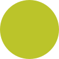

# racket-simple-svg

A SVG(Scalable Vector Graphics) generate tool for Racket
==================

# Install
    raco pkg install simple-svg

# Basic Usage
```racket
(svg-out
  #:canvas? '(1 "red" "white")
  (lambda ()
    (let ([rec (svg-rect-def 100 100)])
      (svg-use rec #:fill? "#BBC42A")
      (svg-show-default))))
```


## svg-out
```racket
(svg-out
  procedure procedure?
  [#:width? width? (or/c #f natural?) #f]
  [#:height? height? (or/c #f natural?) #f]
  [#:padding? padding? natural? 10]
  [#:viewBox? viewBox? (or/c #f (list/c natural? natural? natural? natural?)) #f]
  [#:canvas? canvas? (or/c #f (list/c natural? string? string?)) #f])
```
  canvas size is automatically calculated.
  default generate a svg with a 10 padding.
  you can set size manully by #:width? and #:height?.

  viewBox?: '(x y width height), if needed.

  canvas?: '(stroke-width stroke-fill fill), if needed.

## basic usage

  1. all svg drawings should occur in the svg-out's procedure.
  2. use svg-...-def define shape first.
  3. svg-use reuse the shape in group, if not specify which group, all svg-use included in the default group.
  4. svg-show-default shows default group, or svg-show the specific group.

  define shape first, then define group, reuse shape in group(s) any times and styles, show group(s) in canvas any times.

  the shape's define just contains it's basic properties.
  svg-use add the axis, fill, stroke etcs.

  ie: define a rect by width and height, then resue it by svg-use any times,
      each svg-use can use different axis, fill or stroke.

```racket
  (let (
        [blue_rec (svg-rect-def 150 150)]
        [green_rec (svg-rect-def 100 100)]
        [red_rec (svg-rect-def 50 50)]
        )
    (svg-use blue_rec #:fill? "blue")
    (svg-use green_rec #:fill? "green" #:at? '(25 . 25))
    (svg-use red_rec #:fill? "red" #:at? '(50 . 50))
    (svg-show-default))
```


# Shapes

## Rectangle

```racket
(svg-rect-def
  width natural?
  height natural?
  #:radius? [radius? #f]
```
  define a rectangle.

  use radius to set corner radius: '(radiusX . radiusY).

### rect
```racket
(let ([rec (svg-rect-def 100 100)])
  (svg-use rec #:fill? "#BBC42A")
  (svg-show-default))
```


### with start_point(no padding)
```racket
(let ([rec (svg-rect-def 100 100)])
  (svg-use rec #:fill? "#BBC42A" #:at? '(50 . 50))
  (svg-show-default))
```


### corner radius
```racket
(let ([rec (svg-rect-def 100 100 #:radius? '(5 . 10))])
  (svg-use rec #:fill? "#BBC42A")
  (svg-show-default))
```


### multiple rect
```racket
(let (
  [blue_rec (svg-rect-def 150 150)]
  [green_rec (svg-rect-def 100 100)]
  [red_rec (svg-rect-def 50 50)]
  )
  (svg-use blue_rec #:fill? "blue")
  (svg-use green_rec #:fill? "green" #:at? '(25 . 25))
  (svg-use red_rec #:fill? "red" #:at? '(50 . 50))
  (svg-show-default))
```


## Circle

```racket
(svg-circle-def
   radius natural?)
```
  define a circle by radius length.
  
### circle
```racket
(let ([circle (svg-circle-def 50)])
  (svg-use circle #:at? '(50 . 50) #:fill? "#ED6E46")
  (svg-show-default))
```


### multiple circle
```racket
  (let ([circle (svg-circle-def 50)])
    (svg-use circle #:at? '(50 . 50) #:fill? "red")
    (svg-use circle #:at? '(150 . 50) #:fill? "yellow")
    (svg-use circle #:at? '(50 . 150) #:fill? "blue")
    (svg-use circle #:at? '(150 . 150) #:fill? "green")
    (svg-show-default))
```


## Ellipse

```racket
(svg-ellipse-def
  radius (cons/c natural? natural?))
```
  define a ellipse by radius length: '(width . height).
  
### ellipse
```racket
(let ([ellipse (svg-ellipse-def '(100 . 50))])
  (svg-use ellipse #:at? '(100 . 50) #:fill? "#7AA20D")
  (svg-show-default))
```


## Line

```racket
(svg-line-def
    start_point (cons/c natural? natural?)
    end_point (cons/c natural? natural?))
```
  define a line by start, end point.
  
### line
```racket
(let ([line (svg-line-def '(0 . 0) '(100 . 100))])
  (svg-use line #:stroke? '(10 . "#765373"))
  (svg-show-default))
```


## Polyline

```racket
(define (polyline points stroke_fill stroke_width fill))
```
  define a polyline by points list.
  
### polyline
```racket
(polyline 
    '((0 . 40) (40 . 40) (40 . 80) (80 . 80) (80 . 120) (120 . 120) (120 . 160))
    "#BBC42A" 6 "blue")
```


## Polygon

```racket
(svg-polygon-def
    points (listof (cons/c natural? natural?)))
```
  define a polygon by points list.
  
### polygon
```racket
(let ([polygon
  (svg-polygon-def
    '((0 . 25) (25 . 0) (75 . 0) (100 . 25) (100 . 75) (75 . 100) (25 . 100) (0 . 75)))])
    (svg-use polygon #:stroke? '(5 . "#765373") #:fill? "#ED6E46")
    (svg-show-default))
```


## Raw Path

```racket
(define (raw-path width height raw_data
              #:fill? [fill? "none"]
              #:stroke-fill? [stroke-fill? "#333333"]
              #:stroke-width? [stroke-width? 1]
              #:stroke-linejoin? [stroke-linejoin? "round"])
```
  define a path by raw data.

  raw data normally come from other svg tools.

  raw path's size can't be calculated, so width and height is mandatory.

### rawpath
```racket
(raw-path
  240 166
  "M248.761,92c0,9.801-7.93,17.731-17.71,17.731c-0.319,0-0.617,0-0.935-0.021
  c-10.035,37.291-51.174,65.206-100.414,65.206 c-49.261,0-90.443-27.979-100.435-65.334
  c-0.765,0.106-1.531,0.149-2.317,0.149c-9.78,0-17.71-7.93-17.71-17.731
  c0-9.78,7.93-17.71,17.71-17.71c0.787,0,1.552,0.042,2.317,0.149
  C39.238,37.084,80.419,9.083,129.702,9.083c49.24,0,90.379,27.937,100.414,65.228h0.021
  c0.298-0.021,0.617-0.021,0.914-0.021C240.831,74.29,248.761,82.22,248.761,92z"
  #:fill? "#7AA20D"
  #:stroke-fill? "#7AA20D"
  #:stroke-width? 9
  #:stroke-linejoin? "round")
```


## Path

```racket
(define (path path_proc
              #:fill? [fill? "none"]
              #:stroke-fill? [stroke-fill? "#333333"]
              #:stroke-width? [stroke-width? 1]
              #:stroke-linejoin? [stroke-linejoin? "round"])
```
  define a path programmtially.

  fill?, stroke-fill?, stroke-width? stroke-linejoin? same as raw-path.

  every path step should write in this procedure: moveto, curve etc.

### moveto
```racket
(define (moveto point)
(define (moveto* point)
```
  moveto* use absolute position.

  moveto use relative position.

```racket
  (moveto* '(100 . 100))
```

### Cubic Bezier Curve

```racket
(define (ccurve point1 point2 point3)
(define (ccurve* point1 point2 point3)
```
  use three control points to draw a Cubic Bezier Curve.

  ccurve* use absolute position.

  ccurve use relative position, relative to the start position.

```racket
  (path
    #:stroke-fill? "#333333"
    #:stroke-width? 3
    (lambda ()
      (moveto* '(0 . 50))
      (ccurve* '(20 . 5) '(70 . 5) '(90 . 50))
      (ccurve* '(110 . 95) '(160 . 95) '(180 . 50))))
```


### Quadratic Bezier Curve

```racket
(define (qcurve point1 point2)
(define (qcurve* point1 point2)
```
  use two control points to draw a Quadratic Bezier Curve.

  qcurve* use absolute position.

  qcurve use relative position, relative to the start position.

```racket
  (moveto* '(0 . 50))
  (qcurve* '(50 . 0) '(100 . 50))
  (qcurve* '(150 . 100) '(200 . 50))))
```


### lineto

```racket
(define (lineto point)
```
  lineto* is the absolute version.

  horizontal line: hlineto and hlineto*.
  vertical line: vlineto and vlineto*.

```racket
  (moveto* '(0 . 0))
  (lineto '(100 . 100))
  (hlineto '(-100 . 0))
  (lineto '(100 . -100))
  (close-path)
```


### arc

```racket
(define (arc point radius direction size)
```
  arc* is the absolute version.

  point is the end point.
  
  radius spcify the ellipse's size.
  
  direction is a simplified large-arc-flag and sweep-flag's comibination.
  
  as the arc's size can't be calculated, so should set the arc size manully.
```racket
(path
  #:stroke-fill? "#ccccff"
  #:stroke-width? 3
  (lambda ()
    (moveto* '(120 . 35))
    (arc* '(160 . 75) '(80 . 40) 'left_big '(160 . 75))))

(path
  #:stroke-fill? "green"
  #:stroke-width? 3
  (lambda ()
    (moveto* '(120 . 35))
    (arc* '(160 . 75) '(80 . 40) 'left_small '(160 . 75))))

(path
  #:stroke-fill? "blue"
  #:stroke-width? 3
  (lambda ()
    (moveto* '(120 . 35))
    (arc* '(160 . 75) '(80 . 40) 'right_big '(280 . 110))))

(path
  #:stroke-fill? "yellow"
  #:stroke-width? 3
  (lambda ()
    (moveto* '(120 . 35))
    (arc* '(160 . 75) '(80 . 40) 'right_small '(160 . 75))))
```

